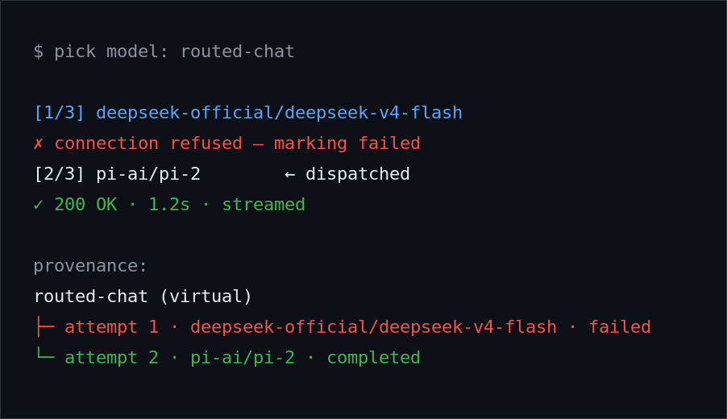

# dsh-model-router

A [DeepSeek Harness](https://www.npmjs.com/package/@deepseek-ai/dsh) (DSH) plugin that
turns model selection into **intelligent routing**: declare a virtual model id in config,
bind it to a routing algorithm over a list of real provider/model candidates, and use the
virtual id anywhere — agent options, model picker. Every call is transparently dispatched
to a real model chosen by the algorithm, with automatic failover.

## What it does

- **Virtual model ids.** A route such as `routed-chat` behaves like any real model in the
  picker, but is a facade over a candidate pool you define.
- **Transparent failover.** When a candidate fails, the next one is tried — same request,
  no user-visible error — and the plugin records which real model served each call, so a
  failover is always visible in the provenance instead of silent.
- **Two routing algorithms** (pluggable extension point):
  - `priority` — always try the first candidate; skip it only on failure. Failed
    candidates get **exponential backoff**, giving a struggling model time to recover
    before it is tried again.
  - `round-robin` — distribute calls across the pool.
- **Your own algorithm.** `RoutingAlgorithm` is a factory contract (`select`, `onFailure`,
  optional `onDispatch`/`onSuccess`) — implement one and register it.

## Why it exists

Model pools are the reality: a cheap fast model, a strong one, a spare. Hardcoding one id
means a provider outage becomes your outage. Routing at the plugin layer means the rest of
the harness never learns about failure — and never has to.

## Install

```bash
npm pack
dsh plugin --profile <your-profile> add file:/path/to/dsh-model-router-<version>.tgz
```

Or straight from GitHub:

```bash
dsh plugin --profile <your-profile> add github:andrepontesmelo/dsh-model-router
```

## Quick start

Add a route to your profile's `cordis.patch.yml`:

```jsonc
{
  "routes": [
    {
      "id": "routed-chat",
      "algorithm": "priority",              // "priority" | "round-robin"
      "candidates": [
        { "provider": "deepseek-official", "model": "deepseek-v4-flash" },
        { "provider": "pi-ai", "model": "..." }
      ]
    }
  ]
}
```

Pick `routed-chat` in the model picker (or set it as an agent's model) and route. On
failover, the response provenance shows the real model that answered and any candidates
sleeping in their backoff window.

<!-- TODO(andre): screenshot of the DSH web UI showing a failover stack explanation.
     Drop at docs/images/failover-stack.png and uncomment:
 -->

### Writing your own algorithm

An algorithm is a factory `(ctx, routes) => algorithm`:

```js
{
  select(route, callCtx)      // -> candidate | undefined (pure — no state advance)
  onFailure(route, candidate) // record the failure so select skips it
  onDispatch?(route, candidate) // first dispatch of a request
  onSuccess?(route, candidate)  // optional
}
```

The shim probes `select` for boolean checks, so it must stay pure; state advances happen
in the `on*` callbacks. The test suite in `test/` pins these seam mechanics.

## Roadmap

- Session stickiness — pin a session to the candidate that first served it *(not yet
  implemented)*.
- Per-model reasoning-level customization *(not yet implemented)*.

## Requirements

- Node ≥ 22.
- A DSH profile to install into; candidates point at providers already configured there.

## Test

```bash
npm test        # unit suite
npm run smoke   # end-to-end smoke against a live profile
```

## License

MIT — see [LICENSE](LICENSE).
