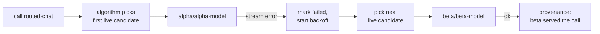

# dsh-model-router

[](https://github.com/andrepontesmelo/dsh-model-router/actions/workflows/ci.yml)

A [DeepSeek Harness](https://www.npmjs.com/package/@deepseek-ai/dsh) (DSH) plugin that
turns model selection into routing: you declare a virtual model id bound to a pool of
real provider/model candidates, pick the virtual id anywhere the harness expects a
model, and every call is dispatched to a real model chosen by the routing algorithm.

## What it does

Your config declares routes. Each route is a virtual model id (`routed-chat`) plus an
ordered pool of real candidates (a cheap fast model, a strong one, a spare). To the
harness — model picker, agent options — the virtual id looks like any other model.
When a call arrives, the plugin's algorithm picks a live candidate and dispatches
through it; if that candidate's stream fails, the next one is tried with the same
request, and the response's provenance always records which real model answered. A
provider outage stops being your outage, and you see it in the provenance instead of
as an error.

Two algorithms ship (`priority` — ordered failover with exponential backoff on failed
candidates; `round-robin` — spread calls across the pool), and an extension point
lets you register your own: a factory returning `{ select, onFailure, onDispatch?,
onSuccess? }`.

Failover for one call, stripped to the loop that matters:


```mermaid
flowchart LR
    V["call routed-chat"] --> P["algorithm picks<br>first live candidate"]
    P --> C1["alpha/alpha-model"]
    C1 -- "stream error" --> F["mark failed,<br>start backoff"]
    F --> R["pick next<br>live candidate"]
    R --> C2["beta/beta-model"]
    C2 -- "ok" --> OK["provenance:<br>beta served the call"]
```

## When to reach for it

- You run more than one model — cheap/fast for most turns, strong for hard ones, a
  spare for when a provider is down — and want one stable id instead of re-picking by
  hand or editing config when something breaks.
- You want failover the rest of the harness never sees: the retry happens inside the
  plugin, the conversation keeps going, and the only trace is which model served.
- You want routing as config, not code — candidates, ordering, and per-candidate
  reasoning effort live in the profile's `cordis.patch.yml`, not in application code.

## Install

Requires Node ≥ 22 and a DSH profile to install into.

```bash
npm pack
dsh plugin --profile <your-profile> add file:/path/to/dsh-model-router-<version>.tgz
```

Or straight from GitHub:

```bash
dsh plugin --profile <your-profile> add github:andrepontesmelo/dsh-model-router
```

Then add a route to your profile's `cordis.patch.yml`:

```yaml
- insert:
    - id: model-router
      name: 'dsh-model-router'
      config:
        routes:
          - id: routed-chat
            algorithm: priority        # "priority" | "round-robin"
            candidates:
              - provider: deepseek-official
                model: deepseek-v4-flash
                reasoning: high        # optional, per-candidate
              - provider: pi-ai
                model: <model id>
```

## It's working if

Pick `routed-chat` in the model picker and send a message — it answers, and the
response provenance shows the real provider/model that served it (not the virtual
id). From the repo itself, the full gate runs green:

```bash
npm test      # 76 unit tests
npm run smoke # 5 in-memory failover drills, zero network
```

## Known limitations

- No session stickiness — consecutive turns of one conversation can land on
  different candidates. Blocked upstream: the plugin picks its candidate at an
  adapter seam that carries no session id.
- A candidate's `reasoning` effort applies only when that candidate's model has a
  matching effort; otherwise the provider default silently applies.
- Routing trusts your config: every candidate you list is a real provider your
  prompts are sent to. Audit a route config you did not write, and pin installs
  (tag or tarball) rather than floating on a branch.

---

[Docs index](docs/index.md) · [Architecture](docs/architecture.md) · [Development](docs/development.md) · [Contributing](CONTRIBUTING.md) · [Security](SECURITY.md) · [License](LICENSE)
